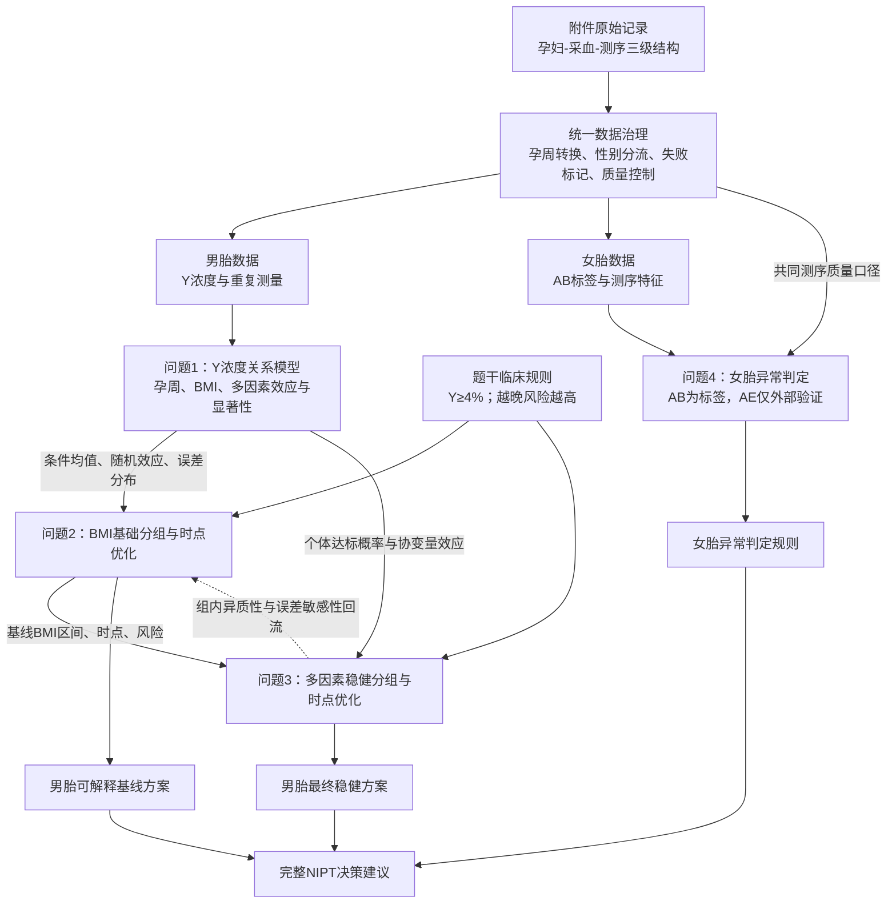

# bzd-modeling-ideas
**Modeling Ideas** 是一款基于过去五年国赛赛题与评委标准答案蒸馏而成的思路生成工具。输入题干后，它不直接给出单一答案，而是先将题目翻译为 "已知 x、构建 f (x)、输出 y" 的直白概述，再输出一张**多模型并行思路表格**—— 每个问题提供数个可贯穿全文、前后联动的候选模型，同时生成流程框架图与创新点建议。其核心逻辑是：建模不是 "拿到一个思路就做"，而是先并行头脑风暴、对比择优，从而摆脱 AI 思路同质化，建立真正具备全局联动性的解题方向。
用户提供完整赛题及附件后，Skill 会先从全题角度重建问题之间的数据流、模型依赖和结果传递关系，再针对每一问生成多种可行建模方案，比较模型的适用条件、优势、局限和验证方法，并给出推荐模型及选用理由。

## 主要功能

- 从整道赛题出发梳理统一的建模主线；
- 分析各问题之间的输入、输出和依赖关系；
- 生成跨问题联动流程图；
- 统一全文的变量、符号、单位、约束和评价指标；
- 针对每一问说明任务、已知条件、目标结果及数学本质；
- 为每一问提供至少两种真正不同的可行模型；
- 使用表格比较模型的假设、步骤、优势、风险和适用场景；
- 给出推荐模型、选用理由、备用模型及替换条件；
- 提供可以实际实现和对照验证的创新方向；
- 设计多模型公平比较、灵敏度分析和稳健性检验；
- 检查漏题、断链、数据泄漏和前后口径不一致。

## 输入

使用者应尽量提供：

- 完整数学建模赛题；
- 所有问题及子问题；
- 附件说明、数据字典、图表和补充规则；
- 实际附件数据；
## 文件结构

```text
bzd-modeling-ideas/
├── README.md
├── SKILL.md
├── agents/
│   └── openai.yaml
└── references/
    ├── integrated-modeling-patterns.md
    └── strategy-output-standard.md
```


以下为 输入2025年C题体题干后，得到的结果展示
## 1. 整题建模主线

全题可拆成“男胎时点决策”和“女胎异常判定”两个模块，但两者共享同一套数据治理、重复测量识别和测序质量控制体系。

- **问题1是男胎主链的基础层**：建立 Y 染色体浓度随孕周、BMI 及其他因素变化的关系，回答“何时、哪些人更容易达到 4%”。
- **问题2是可解释的 BMI 基线决策层**：将问题1的浓度模型转化为首次达标时间或达标概率，联合确定 BMI 分组和各组检测时点，使过早检测失败与过晚发现风险之间的期望损失最小。
- **问题3是多因素稳健扩展层**：在仍输出 BMI 区间和组时点的前提下，把年龄、身高、体重、孕情、测序质量、检测误差和组内达标比例纳入风险计算，修正问题2的简单分组。
- **问题4是并行的女胎分类层**：以 AB 列为题目指定标签，利用 13/18/21/X 染色体 Z 值、GC、读段质量、X 浓度及 BMI 建立可解释、重视召回率的异常判定模型；AE 只用于外部一致性检验，不作为训练标签或输入。

推荐全文采用“**三级层次数据治理 + 广义加性混合模型 + 达标概率/区间删失模型 + 约束最优分箱 + 期望风险决策 + 可解释代价敏感分类**”作为共享主干。其优势是：既处理孕妇重复检测，又保持非线性效应和显著性解释；问题1的输出可以直接驱动问题2、3；问题4沿用相同质量控制和孕妇级验证口径。

## 跨问题联动链



## 3. 全文统一建模口径

| 类别 | 建议口径 | 使用问题 |
|---|---|---|
| 观测层级 | 孕妇代码 B 为个体层；采血事件由 B、H、I 等联合识别；同一采血的重复测序为技术重复 | 全部 |
| 孕周 | 将“周数+天数”统一为连续孕周 `周+天/7`，并用末次月经和检测日期核验 | 全部 |
| 男胎响应 | `Y=V列Y染色体浓度`；达标定义为 `Y≥0.04`，等号计入 | 1—3 |
| 首次达标时间 | 个体潜在轨迹首次越过 4% 的孕周；未观测到达标者视为右删失，跨越前后两次检测者视为区间删失 | 2、3 |
| 女胎标签 | AB 空白编码为无异常；含 T13/T18/T21 的记录按题目实际编码处理为二分类或多标签 | 4 |
| 外部结局 | AE 是出生后结果，只作外部一致性评价，不能成为早期预测输入 | 4 |
| 重复测量 | 训练/测试、交叉验证和 Bootstrap 均按孕妇代码分组，禁止同一孕妇跨集合 | 全部 |
| 测序失败 | 单独建立失败标记；检查与孕周、GC、读段数、过滤比例等的关联，不默认随机缺失 | 1—3 |
| 质量变量 | P、X、Y、Z 的 GC；L、O 读段数；M、N、AA 等比例进入质量控制或误差模型 | 全部 |
| BMI及共线性 | BMI 与身高、体重存在确定关系；若同时入模，采用中心化、VIF、正则化或残差化，避免重复解释 | 1、3、4 |
| 风险函数 | 同时惩罚过早检测不可靠和过晚发现；至少保持“≤12周低、13—27周高、≥28周极高”的顺序 | 2、3 |
| 比较指标 | 男胎：预测误差、校准、达标率、失败率、期望风险、稳定性；女胎：灵敏度、特异度、AUC/PR-AUC、校准 | 全部 |

## 4. 分问题求解思路

### 4.1 问题1

#### 4.1.1 问题概述

- **任务**：分析男胎 Y 染色体浓度与孕周、BMI 及年龄、身高、体重、孕情、测序质量等指标的相关特性，给出关系模型并检验显著性。
- **已知**：同一孕妇可能多次采血、同次采血可能多次测序；Y 浓度存在 4% 达标阈值；测序失败可能与孕周和质量有关。
- **输出**：效应方向、非线性与交互关系、模型方程或函数、显著性检验、置信区间、拟合诊断和适用范围。
- **数学本质**：带有层次重复测量、可能非线性和非随机缺失的纵向回归问题，而不是普通独立样本相关分析。

#### 4.1.2 总体求解思路

先按孕妇—采血—测序三级结构整理数据；将孕周连续化，对同次采血技术重复检查一致性并决定加权聚合或保留随机效应。随后做散点平滑、分层箱线图、组内/组间相关分解，检查孕周与 BMI 的非线性和交互。主模型以孕周、BMI 的平滑函数及交互为固定效应，以孕妇为随机截距，必要时加入随机孕周斜率；测序质量进入协变量或观测权重。最后用似然比/Wald/置换检验评估效应，用残差、异方差、影响点及按孕妇留出验证诊断模型。输出条件均值、个体差异和误差分布，供问题2、3计算达标概率。

#### 4.1.3 可用模型及选型比较

| 可行模型/思路 | 模型本质与核心变量 | 完整实现步骤 | 所需数据与假设 | 优点 | 局限与失败风险 | 验证方法 | 与前后问题的接口 | 适用场景 |
|---|---|---|---|---|---|---|---|---|
| 线性混合效应模型 LMM | `Y~孕周+BMI+交互+协变量+(1+孕周|孕妇)` | 变换孕周；中心化；拟合随机截距/斜率；比较嵌套模型；检验固定效应 | 关系近似线性；随机效应分布可接受 | 方程简洁、显著性清晰、可解释性强 | 难捕捉阈值附近弯曲；边界预测可能偏差 | 残差、QQ图、似然比、组级CV、边际/条件R² | 直接给Q2/Q3均值和方差 | 散点关系近似线性时的基线 |
| 广义加性混合模型 GAMM | `Y~s(孕周)+s(BMI)+ti(孕周,BMI)+协变量+孕妇随机效应` | 平滑项选择；REML估计；检查有效自由度；绘制偏效应；预测分布 | 样本覆盖足够；平滑度可估计 | 同时保留解释性和非线性，适合孕周轨迹 | 高BMI稀疏区域易过拟合；显著性解释需谨慎 | 平滑诊断、组级CV、Bootstrap区间、外推边界检查 | 为Q2/Q3生成任意时点达标概率 | 非线性明显且需统计解释时 |
| 贝叶斯层次纵向模型 | 非线性均值+孕妇随机效应+观测误差层 | 指定先验；联合估计个体轨迹和误差；后验预测；概率化显著性 | 需合理先验和较高计算成本 | 不确定性传播自然，可直接服务风险优化 | 先验敏感、实现复杂、收敛要求高 | R-hat、ESS、后验预测检验、留一法 | Q2/Q3可直接使用后验达标概率 | 需要严谨误差传播和个体化时 |

- **推荐模型**：GAMM。
- **选用理由**：题目要求显著性和关系模型，且孕周—Y 浓度通常存在非线性；GAMM 能处理重复测量、非线性和 BMI 交互，并可为后续时点连续预测。相比黑箱机器学习，它更容易解释和写入论文。
- **备选模型**：若非线性证据很弱，用 LMM 作为更简洁主模型；若检测误差和后验风险传播是全文重点，用贝叶斯层次模型升级。
- **多模型对比建议**：三种模型采用相同孕妇级训练/测试划分，比较组外 RMSE/MAE、阈值附近 Brier 分数、校准曲线及达标概率误差，而不只比较训练集拟合优度。

#### 4.1.4 创新与改进方向

| 创新或改进方向 | 基础方案 | 具体改动与实现步骤 | 预期改进 | 新增工作量 | 验证指标与对照实验 | 风险及备用方案 | 影响的问题 |
|---|---|---|---|---|---|---|---|
| 区分生物重复与技术重复 | 所有行直接回归 | 建立孕妇—采血—测序层级；技术重复估计测量方差，采血重复刻画纵向变化 | 避免伪重复和显著性膨胀 | 中 | 与“每行独立”比较标准误、CV误差 | 层级字段不完整时按B+日期近似 | 全部 |
| 信息性失败修正 | 删除失败记录 | 建立失败概率模型并作逆概率加权，或进行失败情景敏感性分析 | 降低早期成功率高估 | 中 | 比较删除、加权、极端情景的效应和时点 | 失败原因不全时只做上下界 | 1—3 |
| 阈值邻域加权 | 全区间同等拟合 | 对接近4%的观测提高权重，兼顾全局拟合与达标判别 | 提升Q2/Q3时点精度 | 低 | 比较阈值附近Brier/分类误差 | 可能牺牲整体RMSE；保留未加权模型 | 1—3 |

### 4.2 问题2

#### 4.2.1 问题概述

- **任务**：仅以 BMI 为主要分组依据，给出互斥、完整的 BMI 区间和每组最佳 NIPT 时点，使潜在风险最小，并分析检测误差影响。
- **已知**：问题1提供 Y 浓度轨迹；达标为首次 `Y≥4%`；题干给出延迟风险等级。
- **输出**：每组 BMI 边界、样本量、最佳孕周、预计达标率/失败率、风险值及误差敏感性。
- **数学本质**：首次达标时间估计与一维分段决策的联合优化，包含删失、测量误差和风险权衡。

#### 4.2.2 总体求解思路

先由纵向记录构造每位孕妇的首次达标信息：两次检测间跨过4%时记为区间删失，观察期末未达标记为右删失。再估计给定 BMI 的达标时间分布或给定时点的达标概率。设 BMI 切点和组时点为决策变量，定义组内期望风险：过早检测的未达标/失败损失、过晚检测的临床延迟损失，以及可选的分组复杂度惩罚。对候选切点进行动态规划或约束搜索，要求最小组样本量、区间连续、时点位于允许窗口。最后在 Y 测量误差、孕周误差和失败率情景下重复优化，报告边界及时点稳定区间。

#### 4.2.3 可用模型及选型比较

| 可行模型/思路 | 模型本质与核心变量 | 完整实现步骤 | 所需数据与假设 | 优点 | 局限与失败风险 | 验证方法 | 与前后问题的接口 | 适用场景 |
|---|---|---|---|---|---|---|---|---|
| 区间删失生存模型+AFT | 达标时间为事件时间，BMI解释时间尺度 | 构造区间/右删失；拟合AFT；得到条件分位数；搜索分组及时点 | 达标时间分布族合理 | 直接对应“最早达标时间”，处理未达标 | 多次测量稀疏时区间宽；分布假设敏感 | 残差、分布比较、Bootstrap、校准 | Q3加入多因素即可扩展 | 事件时间信息清晰时 |
| GAMM达标概率+风险优化 | 从Q1预测 `P(Y≥4%|w,BMI)` | 蒙特卡洛误差；计算每个BMI/时点风险；动态规划切点 | Q1误差模型可靠 | 与Q1衔接最自然，可连续计算概率 | 首次达标的“持久性”需额外定义 | 概率校准、回代达标率、Bootstrap | 为Q3提供基础风险函数 | 强调全文贯通时 |
| 生存树/最优分箱 | 数据驱动寻找BMI切点 | 以达标时间/风险为响应建树；剪枝；叶节点定时点 | 样本量足够；切点稳定 | 自动发现非线性分界，展示直观 | 切点对样本扰动敏感，容易过拟合 | 嵌套CV、Bootstrap切点频率 | Q3可作对照或候选切点生成器 | 探索分界和建立基线时 |

- **推荐模型**：GAMM 达标概率 + 约束动态规划分箱 + 期望风险优化。
- **选用理由**：直接复用问题1，避免另起一套不一致模型；能同时处理达标率、检测失败、误差和临床延迟风险，并输出可操作的BMI区间。
- **备选模型**：若数据能够可靠识别首次事件区间，则用区间删失 AFT 作为独立验证；若关系高度非线性，可用生存树产生候选切点，但不宜单独作为最终方案。
- **多模型对比建议**：固定最大组数、最小组样本量和同一风险函数，比较总体风险、最差组风险、达标率、切点 Bootstrap 稳定性以及时点对误差的敏感程度。

#### 4.2.4 创新与改进方向

| 创新或改进方向 | 基础方案 | 具体改动与实现步骤 | 预期改进 | 新增工作量 | 验证指标与对照实验 | 风险及备用方案 | 影响的问题 |
|---|---|---|---|---|---|---|---|
| 分组与时点联合优化 | 先聚类再定时点 | 把切点和组时点同时作为决策变量，用动态规划最小化总风险 | 防止局部最优和目标错位 | 中 | 与“两阶段法”比较风险 | 状态空间大时先生成候选切点 | 2、3 |
| 风险上下界而非武断权重 | 固定主观损失系数 | 在符合低/高/极高排序的权重区间内做鲁棒优化 | 降低权重任意性 | 中 | 最坏风险、方案一致区间 | 无共同最优时报告情景方案 | 2、3 |
| 切点稳定性约束 | 只看单次最优 | Bootstrap记录切点分布，只保留高频且临床易执行边界 | 提升可复现与可操作性 | 中 | 切点频率、风险增量 | 稳定性差时减少组数 | 2、3 |

### 4.3 问题3

#### 4.3.1 问题概述

- **任务**：综合身高、体重、年龄等因素、检测误差和各时点达标比例，仍按 BMI 输出合理分组和每组最佳时点，使潜在风险最小。
- **已知**：问题1的多因素效应；问题2的BMI基线分组和风险函数。
- **输出**：修正后的 BMI 区间、各组推荐时点、组内达标概率、风险、误差区间，以及相对问题2的改善。
- **数学本质**：多因素条件风险预测向低维可执行分组决策的压缩，是“个体化预测—群体规则提取—稳健决策”问题。

#### 4.3.2 总体求解思路

建立多因素条件达标概率模型，将年龄、IVF、孕史、身高/体重或BMI构成、测序质量与重复测量纳入。对每位孕妇和候选孕周计算后验/预测达标概率，再在每个候选 BMI 区间内对协变量实际分布积分，得到组达标比例和期望风险。分组仍只以 BMI 呈现，但时点由组内多因素风险决定。优化时同时约束最低达标概率、最小样本量和最差子群风险；最后与问题2在相同验证集、相同风险函数下比较，证明多因素并非“只增加变量”，而是真正改善决策。

#### 4.3.3 可用模型及选型比较

| 可行模型/思路 | 模型本质与核心变量 | 完整实现步骤 | 所需数据与假设 | 优点 | 局限与失败风险 | 验证方法 | 与前后问题的接口 | 适用场景 |
|---|---|---|---|---|---|---|---|---|
| 多因素GAMM+边际风险积分 | 连续浓度/达标概率的可解释非线性模型 | 扩展Q1协变量；对组内人群积分；优化切点及时点 | 训练样本覆盖协变量组合 | 与Q1/Q2最连贯，效应可解释 | 高维交互受样本量限制 | 组级CV、校准、消融、风险回算 | 形成男胎最终主方案 | 样本量中等、强调解释 |
| 联合纵向-生存模型 | Y纵向轨迹与首次达标时间联合建模 | 拟合纵向子模型和事件子模型；共享随机效应；计算个体达标概率 | 需要足够纵向记录 | 同时利用轨迹和删失信息，不确定性一致 | 实现复杂、收敛难 | 后验预测、动态AUC、校准 | 可审计Q2/Q3达标机制 | 重复测量丰富时 |
| 生存森林/梯度提升生存模型 | 非参数多因素达标风险预测 | 孕妇级划分；调参；输出个体生存曲线；再压缩为BMI规则 | 样本量较大；缺失处理一致 | 捕捉复杂交互，预测能力强 | 解释性弱；易把质量噪声学成规则 | 嵌套组级CV、SHAP稳定性、校准 | 作为性能上界和对照 | 数据量足够、追求预测性能 |

- **推荐模型**：多因素 GAMM + 组内边际风险积分 + 稳健分箱优化。
- **选用理由**：在问题1、2主干上自然扩展，能够明确展示每个因素如何改变达标概率，同时仍输出临床可执行的 BMI 区间和统一组时点。
- **备选模型**：纵向记录足够密集时采用联合模型；生存森林用于检验是否存在GAMM未捕捉的强非线性，但最终需蒸馏为可解释规则。
- **多模型对比建议**：使用同一孕妇级外层测试集；比较概率校准、时间依赖Brier、期望风险、最差子群风险、相对问题2风险下降和分组稳定性；复杂模型必须接受消融实验。

#### 4.3.4 创新与改进方向

| 创新或改进方向 | 基础方案 | 具体改动与实现步骤 | 预期改进 | 新增工作量 | 验证指标与对照实验 | 风险及备用方案 | 影响的问题 |
|---|---|---|---|---|---|---|---|
| 预测到规则的蒸馏 | 直接按复杂模型逐人推荐 | 先得个体风险曲线，再优化少量BMI区间近似个体最优决策 | 兼顾个体化与可执行性 | 中 | 与个体最优的遗憾值、规则复杂度 | 遗憾过大时增加组数或二次修正规则 | 3 |
| 最差子群风险约束 | 只最小化平均风险 | 对年龄、IVF或孕史子群加入最大风险上限 | 避免平均最优掩盖高风险人群 | 中 | 平均风险与最差组风险 | 样本少时采用置信上界 | 3 |
| 全链不确定性传播 | 用点预测优化时点 | 从模型参数、测量误差和分组切点联合抽样，得到时点置信区间 | 结论更稳健 | 高 | 覆盖率、方案翻转率 | 计算受限时用Bootstrap近似 | 2、3 |

### 4.4 问题4

#### 4.4.1 问题概述

- **任务**：女胎不含Y染色体，以AB列的13/18/21号非整倍体结果为标签，综合Z值、X浓度、GC、读段质量、BMI等给出异常判定方法。
- **已知**：AB空白表示无异常；Y相关字段在女胎中结构性为空；AE是出生后结果。
- **输出**：标签编码、特征体系、分类模型、阈值/判定规则、混淆矩阵、灵敏度、特异度、概率校准和外部一致性评价。
- **数学本质**：类别不平衡、重复测量和测序质量影响下的代价敏感分类；若AB同时含多个染色体，可扩展为多标签分类。

#### 4.4.2 总体求解思路

先筛选女胎并按孕妇代码去泄漏；AB空白编码正常，异常字符串解析为T13/T18/T21。建立传统Z值规则作为医学可解释基线，再构造多因素特征：Q/R/S/T、W、P/X/Y/Z、读段深度和比对/重复/过滤比例、BMI及必要临床变量。主模型采用带正则化的代价敏感逻辑回归，必要时分别为三种异常建立一对其余模型；树模型作为非线性对照。阈值不以准确率最大为唯一目标，而依据漏诊代价优先保证灵敏度，并报告特异度和校准。所有划分按孕妇分组；AE只在最终阶段检验AB判定与出生健康的一致性。


